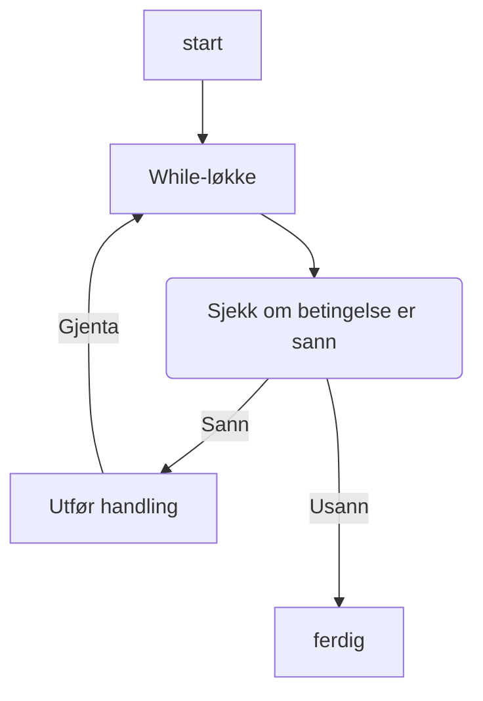

# `while`-løkker


## Hva er en `while`-løkke?

En `while`-løkke, er en løkke der vi gjentar en handling så lenge en betingelse er sann. Vi kan tenke på det som at vi gjentar en handling *så lenge* noe er sant. Generisk ser en `while`-løkke slik ut:

```python
while betingelse:
    # gjør en handling med kode
```

Vi kan visualisere hvordan en `while`-løkke fungerer med følgende flytdiagram:


